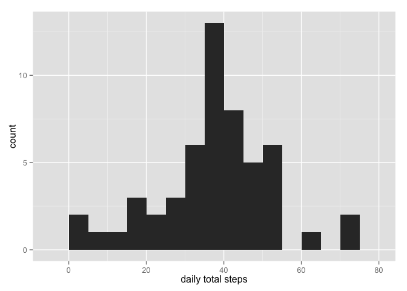
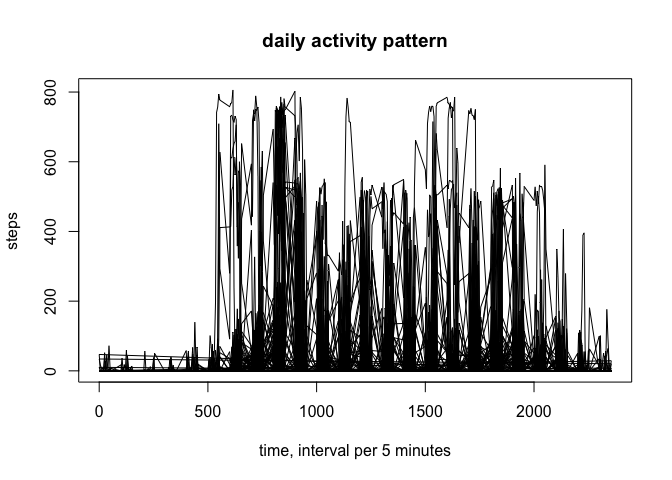
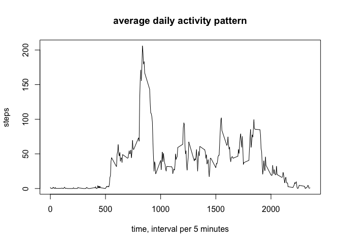
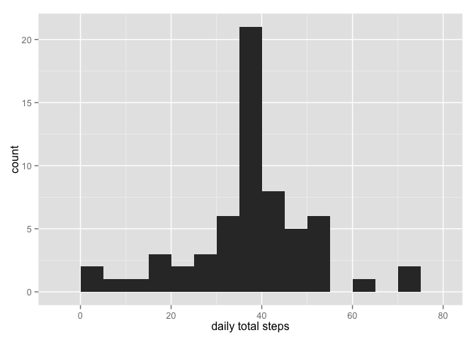
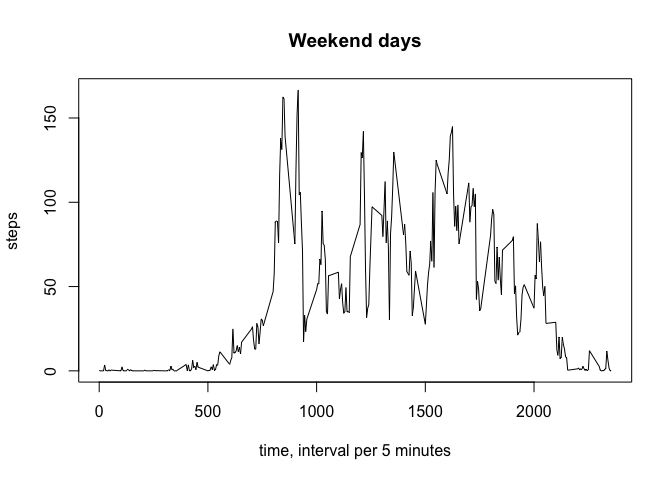
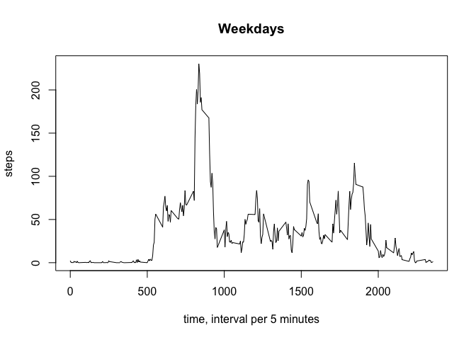

# Reproducible Research: Peer Assessment 1

## Introduction
This project is part of the course Reproducable Research by Roger D. Peng, PhD, Jeff Leek, PhD and Brian Caffo, PhD. This course is given via Coursera. In this report, data from a pedometer is analysed. Pedometers can track the number of steps in an interval and are used for health purposes. 

## Loading and preprocessing the data
The data is analysed in RStudio using R version 3.1.3. First, the data is loaded into R with the read.csv command. The head(Pdata) command loads the first 6 observations to give an impression of the data available. The 3 variables included are: stepts, date and interval.

```r
Pdata <- read.csv("activity.csv")
head(Pdata)
```

```
##   steps       date interval
## 1    NA 2012-10-01        0
## 2    NA 2012-10-01        5
## 3    NA 2012-10-01       10
## 4    NA 2012-10-01       15
## 5    NA 2012-10-01       20
## 6    NA 2012-10-01       25
```
The data still contains missing (NA) values. These have to be deleted before further analysis is possible. The resulting dataframe contains 15264 observations.


```r
Pdata <- Pdata[complete.cases(Pdata),]
dim(Pdata)
```

```
## [1] 15264     3
```

## What is mean total number of steps taken per day?
The data is organized into 5 minutes intervals. This is very detailed and a more general statistic is the total number of steps taken per day and the mean/median of the total in the sample period. 


```r
require(dplyr, warn.conflicts = FALSE, quietly = TRUE)
require(ggplot2, warn.conflicts = FALSE, quietly = TRUE)
Pdata_avg <- Pdata %>% group_by(date) %>% summarize(avg = mean(steps)) 
qplot(avg, data = Pdata_avg, geom = "histogram", binwidth = 5, xlab = "daily total steps")
```

 

```r
mean(Pdata_avg$avg)
```

```
## [1] 37.3826
```

```r
median(Pdata_avg$avg)
```

```
## [1] 37.37847
```

## What is the average daily activity pattern?
The more detailed interval originally used in the dataset can also be displayed into a graph:


```r
plot(Pdata$interval, Pdata$steps, type = "l", xlab = "time, interval per 5 minutes", ylab = "steps", main = "daily activity pattern")
```

 

This is a confusing graph and this can be improved by summarizing the average daily activity pattern:


```r
Pdata_daily <- Pdata %>% group_by(interval) %>% summarize(avg = mean(steps)) 
plot(Pdata_daily$interval, Pdata_daily$avg, type = "l", xlab = "time, interval per 5 minutes", ylab = "steps", main = "average daily activity pattern")
```

 

This grapth makes it clear that there is a particular daily interval with the highest average number of steps:


```r
Pdata_daily[(Pdata_daily$avg == max(Pdata_daily$avg)),]
```

```
## Source: local data frame [1 x 2]
## 
##   interval      avg
## 1      835 206.1698
```

The maximum 5-minute interval is between 8 35 and 8 40 and contains an average of 206 steps. 

## Imputing missing values
The data is analysed with the NA values removed. This can induce bias in the calculations and summaries that have been done already. This part of the analysis looks at partially correcting these biases. First it is determined how many obersations are missing (NA).


```r
Pdata_inc_na <- read.csv("activity.csv")
dim(Pdata_inc_na)
```

```
## [1] 17568     3
```

```r
17568 - 15264
```

```
## [1] 2304
```

There are several strategies possible to estimate what the missing values could have been if they had been registered. One way is to replace missing values with the daily average. Another way is using the average steps per specific interval. The latter approach will be used in this report. Activity varies a lot over the day and this approach reflects that. This code updates the dataset with estimated values for each missing value:


```r
for (i in 1:nrow(Pdata_inc_na)){
        if (is.na(Pdata_inc_na[i,1])) {
                Pdata_inc_na[i,1] <- round(Pdata_daily[
                        Pdata_daily$interval == Pdata_inc_na[i,3], 2 ])
        }
}
```

For this dataset the histogram, mean and median is recalculated:


```r
Pdata_inc_na_avg <- Pdata_inc_na %>% group_by(date) %>% summarize(avg = mean(steps)) 
qplot(avg, data = Pdata_inc_na_avg, geom = "histogram", binwidth = 5, xlab = "daily total steps")
```

 

```r
mean(Pdata_inc_na_avg$avg)
```

```
## [1] 37.38069
```

```r
median(Pdata_inc_na_avg$avg)
```

```
## [1] 37.36806
```

The differences seem to be minimal. 

## Are there differences in activity patterns between weekdays and weekends?
Normally, the activity patterns can differ between weekdays and weekends. One possible reason would be work-related. This final section checks if weekdays and weekends seem to differ from each other. 

In the first step, it is determined whether a day is a weekday or not. 


```r
Pdata_inc_na$date <- as.Date(Pdata_inc_na$date, format = "%Y-%m-%d")
for (i in 1:nrow(Pdata_inc_na)){
        Pdata_inc_na$weekday[i] <- 
                if (weekdays(Pdata_inc_na$date[i]) == "Monday") {"weekday"}
        else if (weekdays(Pdata_inc_na$date[i]) == "Tuesday") {"weekday"}
        else if (weekdays(Pdata_inc_na$date[i]) == "Wednesday") {"weekday"}
        else if (weekdays(Pdata_inc_na$date[i]) == "Thursday") {"weekday"}
        else if (weekdays(Pdata_inc_na$date[i]) == "Friday") {"weekday"}
        else {"weekend"}
}
Pdata_inc_na$weekday <- factor(Pdata_inc_na$weekday)
```

The second step is plotting time-series to compare week days with weekend days. 


```r
Pdata_weekday <- Pdata_inc_na[Pdata_inc_na$weekday == "weekday",] %>% group_by(interval) %>% summarize(avg = mean(steps)) 
Pdata_weekend <- Pdata_inc_na[Pdata_inc_na$weekday == "weekend",] %>% group_by(interval) %>% summarize(avg = mean(steps)) 
plot(Pdata_weekend$interval, Pdata_weekend$avg, type = "l", xlab = "time, interval per 5 minutes", ylab = "steps", main = "Weekend days")
```

 

```r
plot(Pdata_weekday$interval, Pdata_weekday$avg, type = "l", xlab = "time, interval per 5 minutes", ylab = "steps", main = "Weekdays")
```

 

These graphs display different activity patterns for the week days versus the weekend days. 


Thanks for your time.
